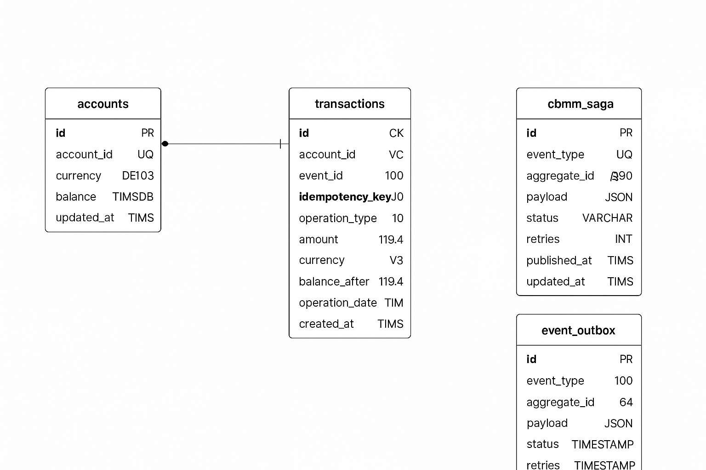

# 🪙 Cobre Platform — Accounts & Movements Services

Sistema financiero distribuido para la gestión de cuentas y movimientos internacionales (**Cross-Border Money Movement - CBMM**).  
Diseñado con **arquitectura reactiva**, **alta concurrencia**, y **procesamiento asíncrono de eventos**.

---

## 🧱 Arquitectura General

### 🧩 Microservicios

| Servicio | Descripción |
|-----------|--------------|
| **accounts-service** | Administra cuentas, saldos y transacciones. Implementa la lógica de débito/crédito, idempotencia y cálculo de balance final. |
| **movements-service** | Orquestador de movimientos FX. Gestiona cotizaciones, publica eventos CBMM y coordina el flujo de transferencias. |
| **api.fastforex.io** | Servicio externo simulado de cotizaciones. Cacheado localmente en Redis. |
| **stress-runner** | Contenedor auxiliar para pruebas de carga concurrente a partir de un CSV. |

---

## 🧩 Diagrama de Arquitectura

```

                         ┌──────────▼──────────────┐
                         │    movements-service    │
                         │ - Cotización FX         │
                         │ - Publica eventos CBMM  │
                         └──────────┬──────────────┘
                                    │
                                📨 Kafka
                                    │
                         ┌──────────▼──────────────┐
                         │     accounts-service    │
                         │ - Aplica débitos        │
                         │ - Aplica créditos       │
                         │ - Controla balances     │
                         └─────────────────────────┘
```

---

## ⚙️ Tecnologías Principales

| Categoría | Stack                                    |
|------------|------------------------------------------|
| **Lenguaje** | Kotlin (JDK 21)                          |
| **Framework** | Spring Boot 3.x + WebFlux + R2DBC + flyway |
| **Base de datos** | MySQL                              |
| **Mensajería** | Kafka                                    |
| **Cache** | Redis                                    |
| **Testing** | JUnit5 + MockK + StepVerifier            |
| **Infraestructura** | Docker / Docker Compose                  |
| **Logs** | JSON estructurado con Logback            |
| **Tareas seguras** | ShedLock + Cron reactivo                 |

---

## 🧠 Principios Técnicos

- 🧩 **Arquitectura Hexagonal (Ports & Adapters)**
- 🧵 **Programación Reactiva** con *Mono* / *Flux*
- 🔒 **Idempotencia** garantizada (`idempotency_key`)
- ⚙️ **Operaciones atómicas SQL:** `balance = balance ± amount`
- 💾 **Cache Redis** con TTL para cotizaciones FX
- 📨 **Mensajería asíncrona** (eventos CBMM + patrón Outbox)
- 🧮 **Cálculo concurrente de balances** sin pérdida de precisión

---

## 🧭 Diagrama de Base de datos para MS-ACCOUNTS (ERD)



## 🚀 Cómo Correr el Proyecto

### 1️⃣ Clonar el repositorio
```bash
git clone https://github.com/nsalone/cobre-platform
cd cobre-platform
```

### 2️⃣ Levantar el entorno local
```bash
docker compose up -d --build
```

Esto levanta:
- `accounts-service` → puerto **8090**
- `movements-service` → puerto **8091**
- `mysql`, `redis`, `kafka`, `zookeeper`

### 3️⃣ Verificar salud de los servicios
```bash
curl http://localhost:8091/actuator/health
curl http://localhost:8082/actuator/health
```

---

## 🧪 Ejecución de Tests

```bash
./gradlew clean test
```

**Casos cubiertos:**
- ✅ `FxQuoteUseCaseTest` → validación de cotizaciones
- ✅ `CBMMRequestUseCaseTest` → eventos de money movement
- ✅ `ApplyTransferUseCaseTest` → débitos / créditos / idempotencia
- ✅ `FinalBalanceCalculationUseCaseTest` → sumatoria y control de balances
- ✅ `CBMMSagaHandlerTest` → orquestación y fallbacks

---

## 🔬 Pruebas de Stress (Carga Concurrente)

### 1️⃣ Archivo CSV (`stress-runner/request.csv`)
```csv
origin_currency,destination_currency,origin_account,destination_account,amount
USD,ARS,ACC987654330,ACC987654321,10
USD,ARS,ACC987654330,ACC987654321,20
USD,MXN,ACC123456789,ACC987654321,15
```

### 2️⃣ Ejecutar el runner
```bash
docker compose -f docker-compose.stress.yml up --build
```

### 3️⃣ Salida esperada
```
🚀 Starting stress test against http://movements-service:8091
➡️  Processing: ACC987654330 → ACC987654321 | amount: 10
✅ Got quote_id: 9c40cb82-84bf-408a-b292-083fe48f8bc0
📦 Response: {"status":"OK"}
```

### 4️⃣ Validar balances finales
```sql
SELECT account_id, currency, balance FROM accounts.accounts;
```

---

## 💱 Ejemplos de Requests

### 💵 Crear cotización
```bash
curl --location 'http://localhost:8091/fx/quote' \
--header 'Content-Type: application/json' \
--data '{
  "origin_currency": "USD",
  "destination_currency": "ARS",
  "amount": 100.00
}
'
```

### 💸 Solicitar transferencia

_quote_id: [resultado de fx/quote]_
_origin_account: [cuenta origen]_
_destination_account: [cuenta destino]_
_amount: [monto de la operación]_

```bash
curl --location 'http://localhost:8091/cbmm/request' \
--header 'Content-Type: application/json' \
--data '{
    "quote_id": "9c40cb82-84bf-408a-b292-083fe48f8bc0", [resultado de fx/quote]
    "origin_account": "ACC987654330", ["cuenta origen"]
    "destination_account": "ACC987654321",
    "amount": 10
}'
```

### 📊 Consultar balance
```bash
curl http://localhost:8090/accounts/ACC987654321
```

---

## ⚙️ Notas Técnicas Clave

| Área | Detalle |
|------|----------|
| **Mensajería (CBMM)** | Usa Kafka o SQS. Los eventos se publican en formato JSON con `eventId`, `operationDate` y `payload`. |
| **Persistencia (R2DBC)** | Totalmente no bloqueante. Transacciones gestionadas por `TransactionalOperator`. |
| **Cache (Redis)** | Guarda cotizaciones (`FxQuote`) por par FX con TTL configurable (`quotation-api.expire-at`). |
| **Atomicidad** | Los updates de balance se hacen con `UPDATE accounts SET balance = balance ± amount` para evitar race conditions. |
| **Idempotencia** | `idempotency_key` único por operación evita duplicados. |
| **Saga Pattern** | Orquesta pasos del flujo CBMM con compensación en caso de error (`completed`, `failed`). |

---

## 📚 Referencias Técnicas

- [Spring WebFlux + R2DBC Guide](https://docs.spring.io/spring-framework/reference/web/webflux.html)
- [Reactive Transactions in R2DBC](https://docs.spring.io/spring-framework/reference/data-access/r2dbc.html#r2dbc.transactions)
- [Idempotent Systems Design – Martin Fowler](https://martinfowler.com/articles/idempotency.html)
- [Transactional Outbox Pattern](https://microservices.io/patterns/data/transactional-outbox.html)

---

## 🧩 Autor

👨‍💻 **Nico Salone**  
_Backend Developer (Kotlin / Java / Go / SQL)_  
Arquitectura, performance y sistemas distribuidos.

---

⭐ **Tip:**  
Antes de ejecutar las pruebas de stress, limpiá la base con:
```sql
TRUNCATE TABLE cbmm_saga;
TRUNCATE TABLE event_outbox;
TRUNCATE TABLE transactions;
UPDATE accounts SET balance = 20000 WHERE currency IN ('ARS', 'MXN');
```

---

> 🧭 *“Build fast. Break safe. Scale clean.”*
